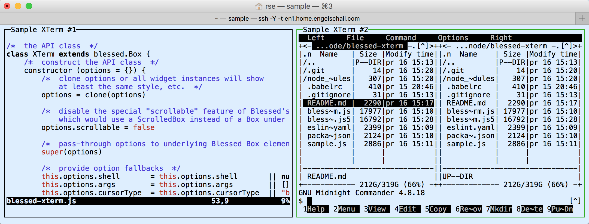

Blessed-XTerm
=============

**XTerm Widget for Blessed Curses Environment**

<p/>


<p/>


Abstract
--------

This is an XTerm emulating terminal widget for the awesome
[Blessed](https://github.com/chjj/blessed) Curses environment of
Node.js. It allows the execution of interactive terminal programs in a
Blessed Box-derived widget while providing a full-featured and fully
compatible emulated XTerm rendering environment to those programs.

Blessed XTerm is actually a more modern variant of the Terminal widget
as shipped with the Blessed Curses environment. The difference to the
regular Terminal widget is: (1) the Blessed XTerm widget uses the
newer and more portable [node-pty](https://github.com/Tyriar/node-pty)
module, instead of the ancient [pty.js](https://github.com/chjj/pty.js/)
module, for Pseudo TTY management, (2) it uses the newer and more
sophisticated [XTerm.js](https://xtermjs.org/) module, instead of the
ancient [Term.js](https://github.com/chjj/term.js/) module, for XTerm
emulation, (3) it provides full scrollback buffer support and (4) it
supports starting and stopping multiple commands while the widget is
active.

Example
-------



Installation
------------

```
$ npm install blessed blessed-xterm
```

NOTICE: The `node-pty` dependency module is a Node.js module with
a native C/C++ component. For this a C/C++ compiler environment is
required during `npm install`. For macOS, ensure you have Apple XCode
and its Command-Line Tools installed (you can find them in XCode
under menu `Xcode` / `Preferences` / `Downloads`). For Windows,
you need Microsoft's Visual C/C++ Build Tools installed (you can
conveniently install them with `npm install --global --production
windows-build-tools` from an elevated shell).

Usage
-----

The Blessed XTerm widget supports all options of the Blessed Box
widget plus the following ones:

- `shell` (default: `process.env.SHELL || "sh"`):<br/>
  The shell to execute.
- `args` (default: `[]`):<br/>
  The arguments for the shell to execute.
- `env` (default: `process.env`):<br/>
  The environment variables for the shell to execute.
- `cwd` (default: `process.cwd()`):<br/>
  The current working directory for the shell to execute.
- `cursorType` (default: `block`):<br/>
  The type of cursor. Either `block`, `underline` or `line`.
- `cursorBlink` (default: `false`):<br/>
  Whether the cursor should blink.
- `scrollback` (default: `1000`):<br/>
  The amount of lines for scrolling back.
- `controlKey` (default: `C-w`):<br/>
  The control key to enter the scrolling mode.
- `ignoreKeys` (default: `[]`):<br/>
  The keys to ignore.
- `style.scrolling.border.fg` (default: `red`):<br/>
  The color of the border during scrolling mode.

The Blessed XTerm widget supports all methods of the Blessed Box
widget plus the following ones:

- `enableInput(enable: Boolean): Void`:<br/>
  Enable or disable the input handling.
- `injectInput(input: String): Void`:<br/>
  Inject input into the terminal as it was typed by the user.
  The input is actually sent to the executed program.
- `write(output: String): Void`:<br/>
  Write output to the terminal as it was output by the executed program.
  The output is just displayed.
- `getScrollHeight(): Number`:<br/>
  Get the actual height in lines of the scrolling area.
- `getScroll(): Number`:<br/>
  Get the current scroll index in lines.
- `setScroll(index: Number): Void`:<br/>
  Scroll the content to an absolute index in lines (same as scrollTo).
- `scrollTo(index: Number): Void`:<br/>
  Scroll the content to an absolute index in lines (same as setScroll).
- `getScrollPerc(): Number`:<br/>
  Get the current scroll index in percentage (0-100).
- `setScrollPerc(percent: Number): Void`:<br/>
  Set the current scroll index in percentage (0-100).
- `scroll(offset: Number): Void`:<br/>
  Scroll the content by a relative offset of lines.
- `resetScroll(): Void`:<br/>
  Reset the scrolling by scrolling to the bottom of the scroll buffer.
- `spawn (shell: String, args: String[], cwd?: String, env?: Object): Void`:<br/>
  Spawn/run a command, optionally first terminating a currently running one.
- `terminate(): Void`:<br/>
  Terminate a currently running/spawned program.
- `kill(): Void`:<br/>
  Tear down the widget.

The Blessed XTerm widget supports all events of the Blessed Box
widget plus the following ones:

- `title` (`title: String`):<br/>
  The program output a sequence to update the terminal with `title`.
- `beep` ():<br/>
  The program output a sequence to beep the terminal.
- `scrolling-start` ():<br/>
  The scrolling mode was started.
- `scrolling-end` ():<br/>
  The scrolling mode was ended.
- `scroll` ():<br/>
  The content was scrolled.
- `exit` (`code: Number`):<br/>
  The spawned program terminated with `code`.
  Usually used in combination with the Blessed XTerm `spawn()` method.
- `update` ():<br/>
  The rendering engine just updated the widget content.
  Usually used in combination with the Blessed Element `screenshot()` method.

License
-------

Copyright (c) 2017 Ralf S. Engelschall (http://engelschall.com/)

Permission is hereby granted, free of charge, to any person obtaining
a copy of this software and associated documentation files (the
"Software"), to deal in the Software without restriction, including
without limitation the rights to use, copy, modify, merge, publish,
distribute, sublicense, and/or sell copies of the Software, and to
permit persons to whom the Software is furnished to do so, subject to
the following conditions:

The above copyright notice and this permission notice shall be included
in all copies or substantial portions of the Software.

THE SOFTWARE IS PROVIDED "AS IS", WITHOUT WARRANTY OF ANY KIND,
EXPRESS OR IMPLIED, INCLUDING BUT NOT LIMITED TO THE WARRANTIES OF
MERCHANTABILITY, FITNESS FOR A PARTICULAR PURPOSE AND NONINFRINGEMENT.
IN NO EVENT SHALL THE AUTHORS OR COPYRIGHT HOLDERS BE LIABLE FOR ANY
CLAIM, DAMAGES OR OTHER LIABILITY, WHETHER IN AN ACTION OF CONTRACT,
TORT OR OTHERWISE, ARISING FROM, OUT OF OR IN CONNECTION WITH THE
SOFTWARE OR THE USE OR OTHER DEALINGS IN THE SOFTWARE.

